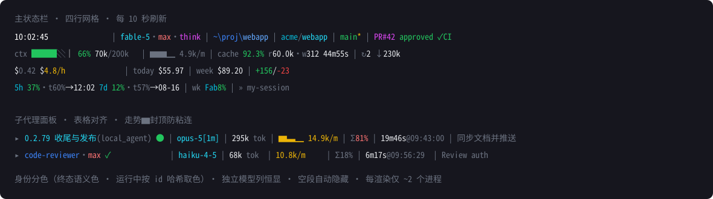

# claude-code-statusline

An information-dense, colorized status line for Claude Code (Windows / Git Bash): a FOUR-line themed grid for the main session plus a fully custom subagent panel row. Segments with missing data disappear cleanly; empty lines vanish; key metrics change color with state.

> 中文原版（权威）见 [README.md](README.md)。This English page is a condensed translation.



```
08:17:08                 | fable-5·max·think | ~\claude-code-statusline  | main*
ctx ███░│ 71% 294k/1M    | ▂▃▂▄ 2.9k/m       | cache 99.3% r337.0k hot   | ↻2 ↓230k
$74.94 $79.8/h           | today $848.27     | week $3822.68             | +2005/-585
5h 32%·t60%→09:10 7d 12% | wk Fab8%          | » session-name
```

- **Line 1 — identity & location**: seconds clock · short model id (panel-style, keeps the `[1m]` tag) + effort heat + thinking marker · abbreviated directory · `⎇ worktree` · repo (OSC 8 hyperlink) · branch + dirty `*` · `⚑N` stash count (bright red at ≥5, hidden at zero) · PR (hyperlink + review state + CI badge)
- **Line 2 — context engine**: `ctx` battery (occupancy = input + latest output tokens; the fifth cell renders as the `│` 80%-compaction marker, `k`/`M` units) · token sparkline (6 glyph levels capped at `▆`) + burn rate · cache hit rate (one decimal) + freshness (hot→countdown→cold) · `↻` compaction count + reclaimed tokens
- **Line 3 — spend**: cost + `$X.X/h` rate · `today` cross-session total · `week` 7-day total · lines changed
- **Line 4 — quota & session**: 5h/7d windows with `·t` pace cursor and reset times · `wk` per-model weekly quota · `»` session name

The subagent panel row (via `subagentStatusLine`) renders every agent as an aligned table row (standalone model column; sparkline capped at `▆`):

```
▸ 0.2.79 收尾与发布(local_agent) ● | fable-5 | 295k tok | ▆▄▁ 14.9k/m | Σ78% | 19m44s@08:11:18 | description…
```

with a STATE-COLORED identity (pending yellow / completed green / failed bright red; everything still in flight gets a PER-AGENT hue picked by a stable hash of its task id, rotating through bright cyan / bright blue / bright magenta / cyan / blue / bright white - running is the state agents spend nearly all their time in, so a fixed color for it made the whole panel read as one solid block, while a per-agent hue keeps concurrent agents apart at a glance and stays the same color for that agent forever, across frames and sessions; the name itself carries the state, so one glance down the left edge reads the whole fleet; the main line stays bright cyan), a standalone always-on short-model column, status glyphs (● ○ ✓ ✗), cumulative token spend (deliberately **not** a fake "context battery" — `tokenCount` is cumulative), sparkline + rate, Σ fleet-share, seconds-precision elapsed time, and a width-budgeted description. Columns align using true display-width measurement (CJK = 2 cells).

## Install

Requirements: Claude Code ≥ 2.1.221 (subagent effort field), Git Bash (bash ≥ 4.3 — `local -n` namerefs, UTF-8), `jq`, `git` (≥ 2.35 for the stash segment).

One-liner (idempotent — re-running updates; offline when run inside a local clone):

```bash
curl -fsSL https://raw.githubusercontent.com/googxi1310328414-afk/claude-code-statusline/main/install.sh | bash
```

It atomically installs the four scripts, creates `statusline-panel.d/`, MERGES settings.json (existing keys preserved, original backed up) and smoke-tests the render; append ` -s -- --with-watchdog` to also register the Windows watchdog task. Manual steps:

1. Copy all FOUR `.sh` files into `~/.claude/`: `statusline-command.sh` (main renderer), `subagent-statusline.sh` (panel renderer), `statusline-panel-hook.sh` (the instant-return panel hook) and `statusline-panel-daemon.sh` (the resident panel renderer the hook spawns).
2. Create the panel state directory `~/.claude/statusline-panel.d/`.
3. Merge the two keys from `settings-snippet.json` into `~/.claude/settings.json` (statusLine points at the main script, subagentStatusLine at the panel HOOK — not at the panel renderer directly).
4. Done — the status line re-renders on the next refresh.

**Recommended**: feed [`AI-GUIDE.md`](AI-GUIDE.md) (Chinese; the complete build spec with data contracts, thresholds, robustness rules and a verification checklist) to Claude Code and let it rebuild and adapt everything for your machine.

## Testing

```bash
bash test.sh          # render all fixtures (see real colors in your terminal)
bash test.sh --codes  # show ANSI escapes as \e[..m for inspection
bash test.sh --assert # 152 assertions (CI mode; perf gates + nineteen adversarial-review regression groups + color asserts)
```

## Notable engineering notes

- Auto-refresh = event-driven repaints (~300 ms debounce) + a `refreshInterval` timer (main 10s here; the subagent panel runs on the host's own fixed ~5s tick — a refreshInterval under subagentStatusLine is ignored, measured on 2.1.229) that re-runs the whole script with fresh stdin JSON even when idle. A new trigger CANCELS the in-flight render, so the interval must comfortably exceed worst-case render time (0.4–1.3 s measured) — undershooting it blanks the bar entirely. settings.json changes hot-reload by CONTENT (touching mtime does nothing), which is also the no-restart recovery path if the render loop ever wedges.
- Windows `jq` emits CRLF: every line-wise read must pass through `tr -d '\r'` (MSYS bash strips trailing CRs in `$(...)` substitutions, `mapfile` does not).
- Scripts export `LC_ALL=C.UTF-8` — column alignment depends on character-based (not byte-based) string measurement, plus a `disp_width()` that counts East-Asian wide characters as 2 terminal cells.
- Two-tier spend store: fine-grained history is kept for only 90 minutes (it only feeds sparkline/rate/$-per-hour); today/week read a tiny per-day rollup file maintained incrementally with a watermark (replay-safe, self-healing under concurrent sessions, and net of each day's midnight baseline - the per-session cost counter does not reset at midnight, so a day owns only what was spent during it) — renders never re-walk days of rows.
- The panel daemon kills a hung render child at a hard deadline (default 15 s, `STATUSLINE_PANEL_RENDER_TIMEOUT`) and skips the frame — a wedged child can no longer freeze every session's panel behind an "alive" pid probe.
- The transcript tail window (512 KiB) is pre-filtered by one `tail | awk` pipe: bash splits only the few matched lines, so the frame cost follows match count, not window bytes (`mapfile <<<` measures ~3.5 µs/byte on MSYS — splitting IS O(bytes)).
- The PR CI badge cache is one file PER (repo, PR) with negative caching — concurrent sessions on different PRs stopped evicting each other every frame.
- Workflow/ultracode fleets do **not** flow through `subagentStatusLine` (measured empirically); they render in the dedicated `/workflows` UI, which has no customization hook.

MIT licensed.
